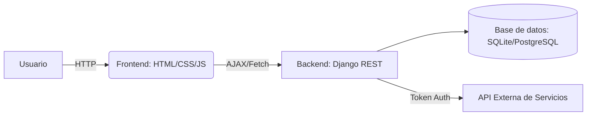

# **JoinProject**

## Descripción general

JoinProject es una plataforma web diseñada para facilitar la gestión de citas médicas en clínicas. Su objetivo es ofrecer a pacientes y personal administrativo:

* **Reservas y gestión de citas** de forma simple y segura.
* **Integración con servicios externos** para catálogos de salud.
* **Páginas informativas** sobre la clínica y sus servicios.

El backend está implementado en **Django** y el frontend con **HTML**, **CSS** y **JavaScript**.

## Características principales

1. **Autenticación de usuarios**

   * Registro de pacientes con datos personales y verificación por correo.
   * Inicio/cierre de sesión seguro con contraseñas encriptadas.
2. **Gestión de citas**

   * Solicitud, modificación y cancelación de citas.
   * Comprobación automática de solapamientos.
3. **Integración de servicios**

   * Consumo de API externa para catálogo de servicios.
   * Almacenamiento local automático de nuevos servicios.
4. **Contenido estático**

   * Páginas: Inicio, Nosotros, Centros, Servicios de Salud, Contacto.

## Arquitectura del sistema



## Requisitos previos

* **Python 3.8+**
* **Docker** y **Docker Compose**
* (Opcional) **PostgreSQL** para producción

## Instalación y ejecución

```bash
# Clonar el repositorio
git clone https://github.com/DiogoPires2003/JoinProject.git
cd JoinProject

# Crear y activar entorno virtual
python -m venv venv
source venv/bin/activate    # macOS/Linux
# venv\Scripts\activate    # Windows

# Configurar variables de entorno
cp .env.example .env
# Editar .env con credenciales y URLs

# Levantar contenedores
docker-compose up --build

# Acceder en el navegador:
# http://localhost:8000
```
### Listar servicios disponibles

```http
GET /api/servicios/
Authorization: Bearer <token>
```
## Guía para desarrolladores

1. **Estructura de carpetas**

   * `healthapp/`: código de la aplicación Django.
   * `static/`: recursos estáticos y plantillas.
   * `docker/`: configuraciones Docker.
     
2. **Modelos principales**
   * `Patient`: datos de usuario y lógica de confirmación.
   * `Service`: catálogo de servicios.
   * `Appointment`: gestión de citas con restricción de solapamiento.
3. **Punto de entrada**
   * Archivos `views.py`, `urls.py` y `forms.py` describen la lógica de negocio.
4. **Migraciones**
   ```bash
   python manage.py makemigrations
   python manage.py migrate
   ```
5. **Pruebas**

   ```bash
   python manage.py test
   ```

## Diagrama de componentes
```


```    
## Checklist de calidad (ISO/IEC 25000)

| Característica     | Criterio                                                     | Cumplido (✓/✗) | Observaciones                           |
| ------------------ | ------------------------------------------------------------ | -------------- | --------------------------------------- |
| **Entendibilidad** | Lenguaje claro y coherente en toda la documentación          | ✓              | Uso de términos definidos y ejemplos    |
| **Completitud**    | Cobertura de instalación, uso, API, desarrollo y despliegue  | ✓              | Falta incluir endpoints avanzados       |
| **Consistencia**   | Formato uniforme (nomenclatura, estilo de código y markdown) | ✓              | Se unificó estilo de cabeceras y listas |
| **Exactitud**      | Información correcta y actualizada                           | ✓              | Variables de entorno definidas en .env  |
| **Trazabilidad**   | Referencias cruzadas (diagrama, código, ejemplos)            | ✓              | Diagramas enlazados y ejemplos de API   |

## Contribución

1. Crear una rama por característica: `feature/mi-nueva-funcionalidad`
2. Seguir [convenciones de estilo Django](https://docs.djangoproject.com/).
3. Realizar pruebas y abrir Pull Request.

## Licencia

Este proyecto se distribuye bajo la licencia MIT. Véase el archivo [LICENSE](LICENSE).

## Contacto

Para soporte, sugerencias o incidencias, abre un issue en GitHub o contáctanos en:

* Correo: [soporte@joinproject.example](mailto:soporte@joinproject.example)
* Repositorio: [https://github.com/DiogoPires2003/JoinProject](https://github.com/DiogoPires2003/JoinProject)
